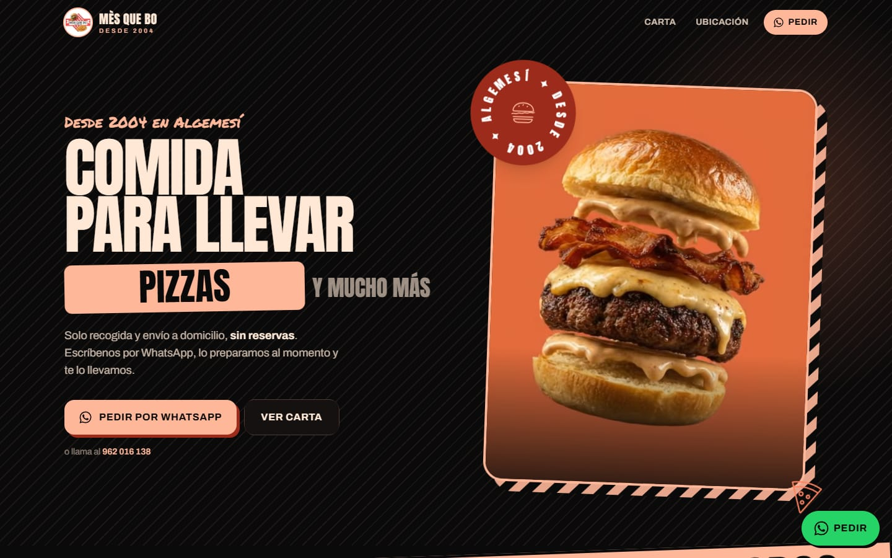
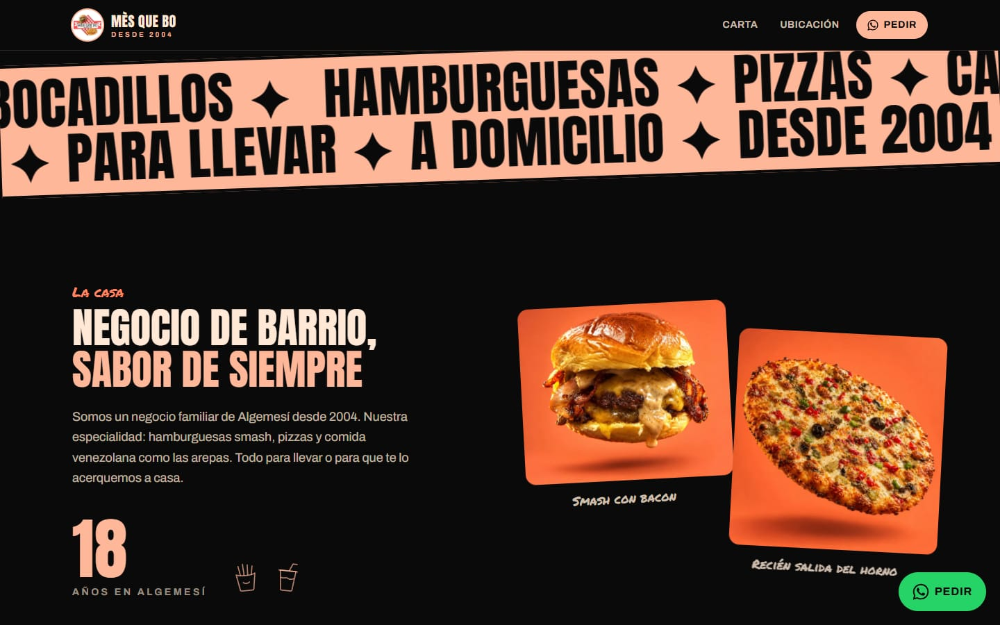
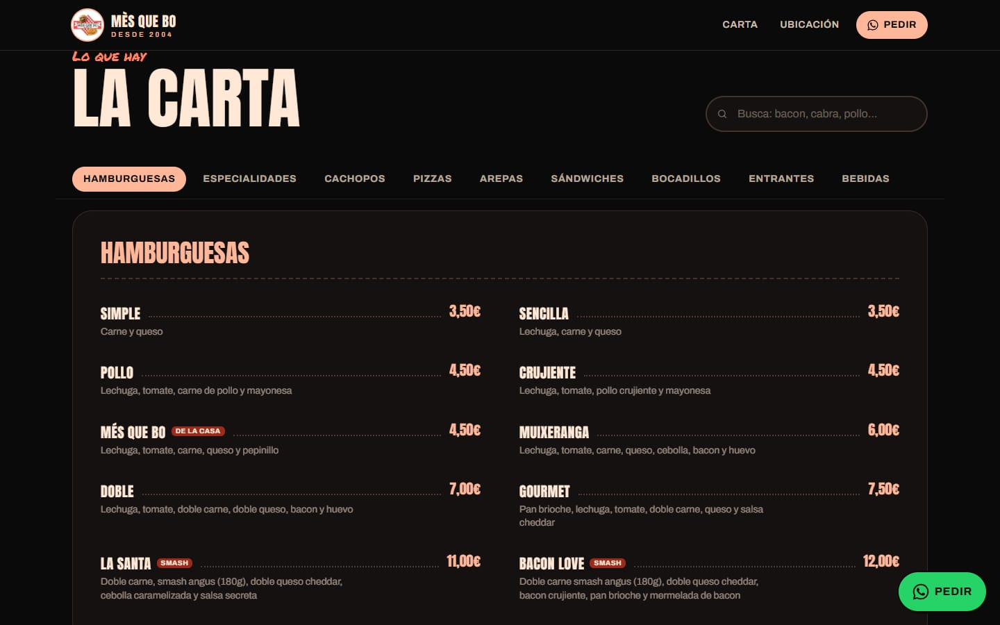
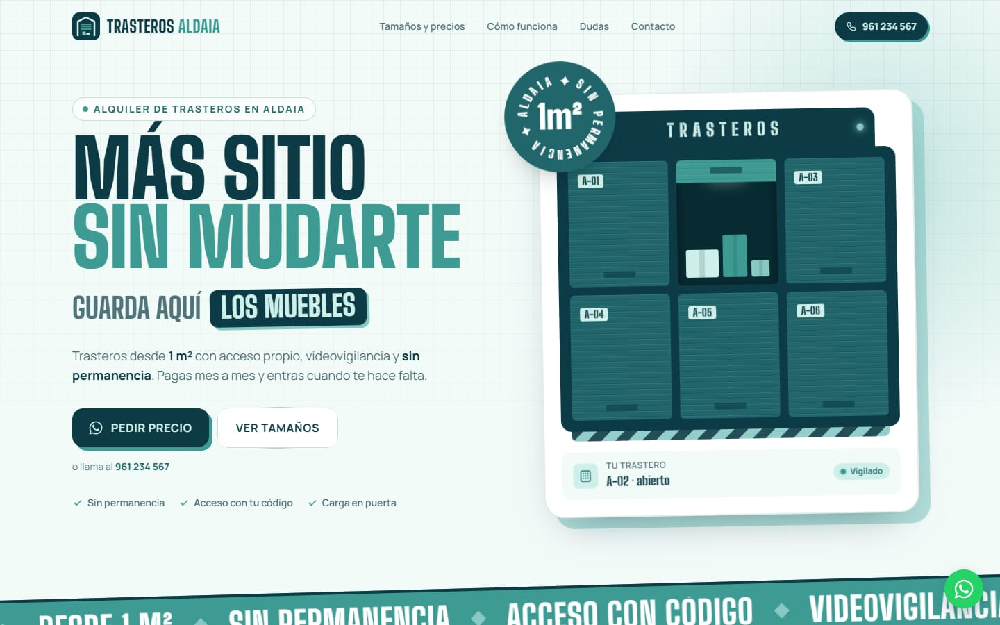
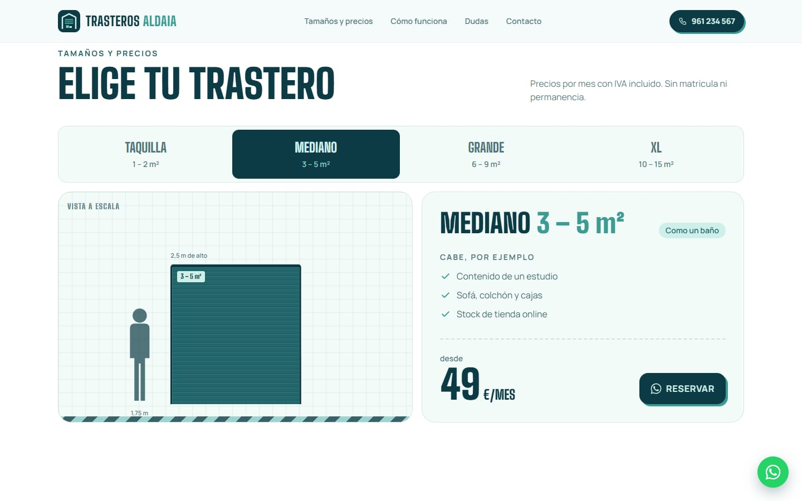
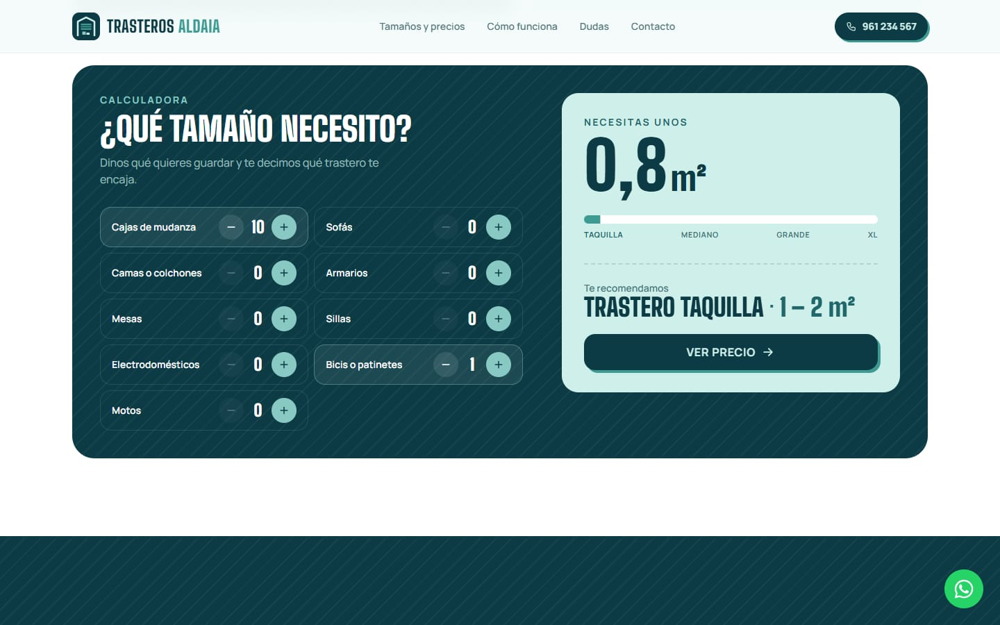

# 🎯 One-Shoot

**Skill para [Claude Code](https://claude.com/claude-code) que crea, desde el primer prompt, landings increíbles para negocios** (restaurantes, tiendas, clínicas, talleres, servicios…). Se invoca con **`/oneshot`**.

Le pasas un **PRD/brief**, **unos pocos assets** (fotos, logo, quizá un vídeo) y una **paleta de colores**, y Claude:

1. Elige una **dirección de arte propia para ese negocio** (12 direcciones: rótulo de barrio, editorial, artesanal, lujo sobrio, neón nocturno, suizo técnico, brutalista, retro 70s, minimal cálido, pop, inmersivo 3D, mediterráneo) y una composición de hero distinta a la de la web anterior.
2. Explora **los 211+ componentes de [React Bits](https://github.com/DavidHDev/react-bits)** y escoge los 8-14 que mejor cuentan esa marca, con un presupuesto de rendimiento (máx. 1 WebGL, máx. 2 bucles a la vez).
3. Monta **Next.js 14 + Tailwind + motion** sobre una base técnica probada en producción.
4. Anima siguiendo la filosofía de **[Emil Kowalski](https://github.com/emilkowalski/skills)** (curvas, duraciones, `:active`, stagger, reduced-motion…).
5. Optimiza los assets (WebP, vídeo mp4+webm con póster) **sin recortar tus fotos**.
6. Verifica en **iPhone emulado** (desbordes, capturas, FPS de scroll, errores) y pasa un **control de calidad de director de arte**.
7. Despliega en **Vercel** y pasa **Lighthouse** móvil (objetivo: 90+, CLS 0).

Sin inventar datos: horarios, reseñas o precios que no estén en el brief se omiten y se te listan como pendientes.

### Por qué no salen todas iguales
- **Historial** (`~/.oneshot/history.json`): cada web registra su dirección y componentes; la siguiente debe usar otra dirección y al menos la mitad de componentes distintos.
- **Brief de diseño obligatorio** antes de escribir código: dirección, momento firma, composición del hero, tipografías, solución por sección y componentes con su *papel* y su *porqué*.
- **Todo el catálogo accesible** con `scripts/bits.mjs` (buscar, ver props y uso oficial, añadir con dependencias compatibles), no un set fijo de favoritos.

---

## Ejemplos reales

Dos negocios hechos con la primera versión de la skill. Tienen personalidad y rendimiento, pero comparten fórmula (palabra rotatoria + sello giratorio + franja inclinada en el hero): justo lo que la v2 evita con direcciones de arte e historial.

### 🍔 Mès Que Bo — hamburguesería take-away
**→ [mesquebo-web.vercel.app](https://mesquebo-web.vercel.app/)**

Hecha a partir de un brief en Markdown, 3 fotos, un vídeo y una paleta de 5 colores. Lighthouse móvil: rendimiento ~90, accesibilidad / buenas prácticas / SEO 100, CLS 0.



| Sobre nosotros | Carta con pestañas y buscador |
|---|---|
|  |  |

Componentes de React Bits: RotatingText, CircularText, ScrollVelocity, CurvedLoop, CountUp, TiltedCard, SpotlightCard, Magnet, ClickSpark, StarBorder.

### 📦 Trasteros Aldaia — alquiler de trasteros
**→ [trasteros-aldaia-web.vercel.app](https://trasteros-aldaia-web.vercel.app/)**

Negocio de servicios, sin fotos de producto: el hero es una ilustración de la nave hecha con CSS, y la web gira en torno a elegir tamaño (vista a escala con una persona de referencia) y una calculadora de "¿qué tamaño necesito?" que recomienda trastero.



| Tamaños y precios | Calculadora de espacio |
|---|---|
|  |  |

---

## Instalación

### Opción A — Script (recomendada: queda como `/oneshot`)
Copia la skill a `~/.claude/skills/oneshot`, instala las dependencias de los scripts y precarga React Bits.

**macOS / Linux / Git Bash**
```bash
curl -fsSL https://raw.githubusercontent.com/dfadify-web/lizard-bits/main/install.sh | bash
```
**Windows (PowerShell)**
```powershell
irm https://raw.githubusercontent.com/dfadify-web/lizard-bits/main/install.ps1 | iex
```

### Opción B — Plugin de Claude Code
Dentro de Claude Code:
```
/plugin marketplace add dfadify-web/lizard-bits
/plugin install oneshot@oneshot
```
Como plugin, Claude Code puede mostrar el comando con el prefijo del plugin; también se activa sola cuando pides una web para un negocio. Las dependencias de los scripts las instala la propia skill la primera vez.

### Opción C — Manual
```bash
git clone https://github.com/dfadify-web/lizard-bits.git
cp -R lizard-bits/skills/oneshot ~/.claude/skills/
npm install --prefix ~/.claude/skills/oneshot/scripts
node ~/.claude/skills/oneshot/scripts/bits.mjs sync
```

Reinicia Claude Code tras instalar.

### Requisitos
- **Node.js 18+**, npm y **git**
- **Google Chrome** (o Chromium/Edge) instalado — los scripts lo usan vía `puppeteer-core`, no descargan navegador. Si no lo detecta: `export CHROME_PATH=/ruta/a/chrome`.
- **ffmpeg** (solo si hay vídeo): `brew install ffmpeg` · `winget install Gyan.FFmpeg` · `sudo apt install ffmpeg`
- Cuenta de **Vercel** para el deploy (`npx vercel login`)

---

## Uso

```
/oneshot
```
o simplemente:

> Crea una landing para mi negocio. Brief en `~/Downloads/brief.md`, assets en `~/Desktop/assets-cliente`, color principal `#FFB79A` y esta paleta: #FFE8D6 #FF8360 #9C2B1B.

Qué conviene pasarle:
| Entrada | Ejemplo |
|---|---|
| Brief / PRD | nombre, contacto (WhatsApp, IG, dirección), secciones, carta o servicios con precios |
| Assets | 2-6 fotos de producto, logo, opcional un vídeo corto vertical |
| Paleta | hex o una imagen con los colores + cuál es el principal |
| (Opcional) Tono | "quiero algo editorial", "más canalla", "tipo revista"… para orientar la dirección de arte |

### Explorar React Bits a mano
El mismo script que usa la skill sirve para curiosear el catálogo:
```bash
B=~/.claude/skills/oneshot/scripts/bits.mjs
node $B list --q "text reveal"          # buscar por descripción/etiquetas
node $B list --cat Backgrounds --cost light
node $B info SplitFlapText Stack        # props, uso oficial, dependencias y avisos de rendimiento
node $B add Stack --project ./mi-web --install
node $B history                         # webs anteriores (dirección + componentes)
```

---

## Qué incluye

```
skills/oneshot/
├── SKILL.md                      # flujo completo: brief de diseño → build → QA → deploy + errores ya cometidos
├── references/
│   ├── emil-design-eng.md        # filosofía de animación de Emil Kowalski (MIT)
│   ├── art-directions.md         # 12 direcciones de arte, 12 composiciones de hero, alternativas por sección
│   ├── react-bits-notes.md       # elegir por papel, presupuesto de rendimiento, integración, parches, lista negra
│   └── react-bits-catalog.md     # catálogo completo generado: descripción, deps, coste 🟢🟡🔴, avisos
├── template/                     # base técnica probada en producción
│   ├── tailwind.config.ts, next.config.mjs, .eslintrc.json
│   ├── app/globals.css           # entradas CSS antes de hidratar, reveal, :active, reduced-motion
│   ├── components/Reveal.tsx, useInViewPause.ts
│   ├── components/bits/*         # React Bits parcheados (bits.mjs los usa automáticamente)
│   └── *.example.tsx / lib/*.example.ts   # referencia de técnica, no de maqueta
└── scripts/
    ├── bits.mjs                  # acceso a TODO React Bits: sync, list, info, add, catalog, history, log
    ├── optimize-media.mjs        # assets → webp/mp4/webm/póster, sin recortar; imprime ratio y color de fondo
    └── mobile-check.mjs          # iPhone emulado: desbordes, capturas, FPS, errores
```

### Lecciones incorporadas (para que no te pasen)
- `Noise` de React Bits y overlays `mix-blend` a pantalla completa **congelan** la página → prohibidos.
- `CurvedLoop` hacía `setState` en cada frame y se congelaba en táctil → parcheado.
- Hero invisible hasta hidratar (motion `initial opacity 0`) → entradas en CSS.
- Animar la opacidad del póster del vídeo retrasa el LCP ~600 ms → solo transform.
- Palabra rotatoria que empuja el texto (CLS) → ancho fijo con sizer invisible.
- Al cambiar una imagen con el mismo nombre, la caché muestra la vieja → versionar (`-v2`).
- `@react-three/fiber` 9 no funciona con React 18 (Next 14) → `bits.mjs add` fija versiones compatibles.
- Clonar React Bits entero son 263 MB (vídeos de la web de demos) → clon parcial de 14 MB.

---

## Créditos y licencias
- Código propio de este repo: **MIT** (ver `LICENSE`).
- `references/emil-design-eng.md`: © Emil Kowalski, **MIT** — [emilkowalski/skills](https://github.com/emilkowalski/skills).
- `template/components/bits/*` y los componentes que `bits.mjs` descarga: **React Bits** © David Haz, **MIT + Commons Clause** — [DavidHDev/react-bits](https://github.com/DavidHDev/react-bits). Puedes usarlos en webs (también de clientes); no puedes vender los componentes en sí. `references/react-bits-catalog.md` incluye las descripciones del catálogo oficial. Ver `THIRD_PARTY_NOTICES.md`.

Proyecto no afiliado a Anthropic, Emil Kowalski ni React Bits.
